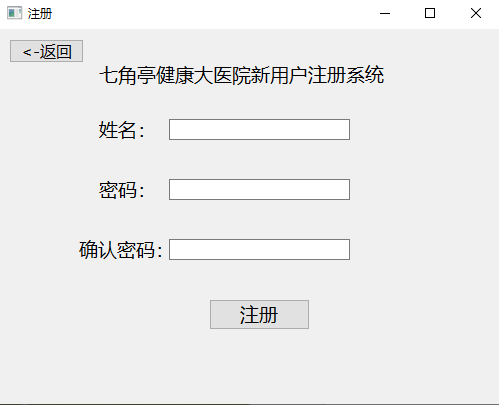
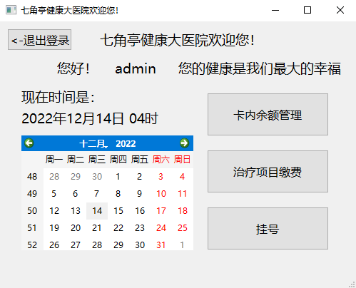
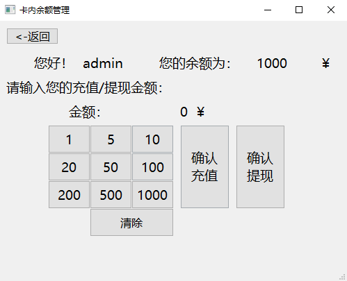
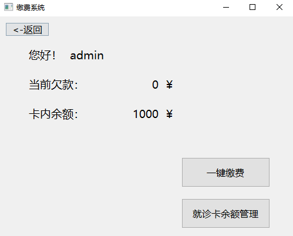
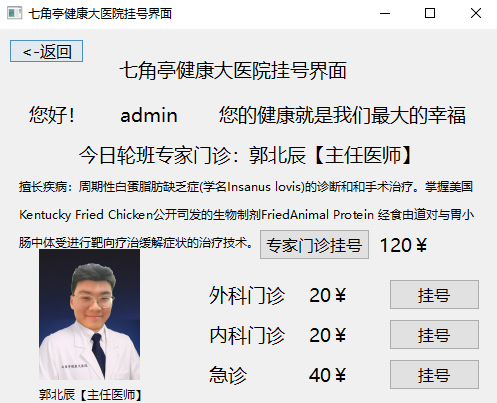
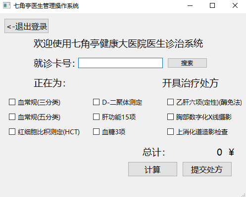

# 🏥 七角亭健康大医院缴费管理系统

## 📖 项目简介

七角亭健康大医院缴费管理系统是中国地质大学（武汉）C 语言课程设计项目中的一部分，该项目的目标是创建一个能够管理医院用户卡的系统，包括挂号、缴费、卡内余额管理等功能。通过使用 C++ 和 Qt 框架，本项目旨在展示课程所学内容的实际应用，并且在用户交互方面做出了创新。

## 🎯 设计目标

该系统旨在实现以下主要功能：
- 办理就诊卡
- 挂号
- 诊治与缴费
- 取药缴费
- 查询卡内余额
- 续费充值

## 🛠️ 功能特性

- **🔐 用户登录与医生登录**：
  - 用户通过卡号和密码登录系统。
  - 医生登录需勾选专属选项，登录后可进入医生管理界面。

- **📝 用户注册**：
  - 新用户可以通过简单的表单完成注册。
  - 注册后系统自动生成并返回新卡号。

- **🏠 主界面功能**：
  - 显示当前日期和时间，提供直观的日历视图。
  - 用户可以在此界面选择管理卡内余额、查看治疗项目等功能。

- **💳 卡内余额管理**：
  - 支持用户充值和提现操作，界面简洁易用。

- **💰 缴费系统**：
  - 用户可以一键清算欠款，查看当前余额，轻松完成支付。

- **👨‍⚕️ 医生操作**：
  - 医生可以通过就诊卡号检索患者，进行治疗项目的选择和费用计算，最后提交处方。

## 📸 界面预览

| 登录界面 | 注册界面 |
| --- | --- |
|  |  |

| 主界面 | 卡内余额管理 |
| --- | --- |
|  |  |

| 缴费系统 | 医生挂号界面 | 医生管理界面 |
| --- | --- | --- |
|  |  |  |

## 🔍 程序设计与实现

本系统通过模块化设计来实现其各项功能。以下是主要模块的介绍：

- **界面显示与信息展示**：
  - 系统使用 Qt 的 `QMainWindow` 作为主界面框架，并通过 `QSqlQueryModel` 来从数据库中读取用户信息，并实时显示在界面上。
  
- **用户登录处理**：
  - 通过用户输入的卡号和密码，系统会查询数据库进行验证，并根据用户角色（普通用户或医生）加载相应的界面。
  
- **卡内余额管理**：
  - 系统支持用户的充值和提现操作，通过更新数据库中的余额字段来实现，并且会实时更新显示在用户界面中。

## 🧩 系统特点

- **图形用户界面 (GUI)**：
  - 相比传统的控制台操作，本系统创新性地采用了 Qt 进行图形界面的开发，大大提升了用户体验。
  
- **数据库集成**：
  - 系统采用 SQLite 数据库来存储用户数据，增强了系统的稳定性和数据处理能力。

## 🚀 后续拟改进功能

考虑到开发时间等因素，目前系统仍有一些可改进之处，后续更新计划如下：
- **用户密码加密**：
  - 将用户密码存储规则更改为 MD5 或简易哈希认证，提升数据安全性。
  
- **界面优化**：
  - 对用户交互界面进行美化和优化，使其更加符合现代审美。

- **硬件集成**：
  - 在卡内余额管理界面中，引入硬件设备端口，以支持物理刷卡操作。

---

> **联系方式**：如果您有任何问题或建议，欢迎通过邮箱 [songjinglei@cug.edu.cn](mailto:songjinglei@cug.edu.cn) 联系我。也欢迎访问我的 [GitHub 个人资料](https://github.com/<RaySong513>) 与我联系。
